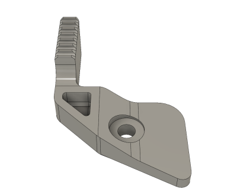
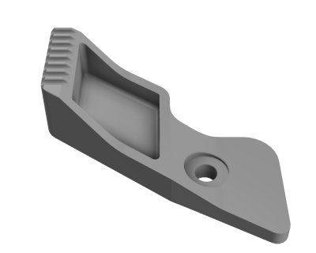

# 3D Holster Claw (06/2019)

<table>
<tr>
<td></td>
<td></td>
</tr>
<tr>
<td></td>
<td></td>
</tr>
<tr>
<td></td>
<td></td>
</tr>
</table>

A holster claw accessory designed to fit the right-handed [Tulster Springfield Armory XD-S 3.3" IWB holster](https://tulster.com/springfield-armory-xds-3-3-9-40-45-iwb-aiwb-kydex-holster-profile-holster/) for Appendix IWB carry. This holster claw fits snugly in the corner between the trigger guard and the frame, so that it can be used with single retention screw Kydex holsters. Thread locker should be used with the retention screw. Small and large size variants of the holster claw are included. The design's footprint can be modified to fit other holsters.

**Design:** [Holster Claw Small v81.f3d](Holster%20Claw%20Small%20v81.f3d) (Fusion 360 Archive)

**Design:** [Holster Claw Large v51.f3d](Holster%20Claw%20Large%20v51.f3d) (Fusion 360 Archive)

**Design:** Small https://a360.co/2Eb4Bt9 (A360)

**Design:** Large https://a360.co/2Iz6m9j (A360)

**STLs:**

  * [Holster Claw Small.stl](stls/Holster%20Claw%20Small.stl)
  * [Holster Claw Large.stl](stls/Holster%20Claw%20Large.stl)

**Recommended Print Settings:** 0.20mm layer height, 20% infill, PETG for durability

**Thingiverse:** https://www.thingiverse.com/thing:3673227

**License**: 
